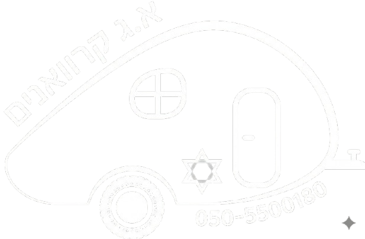
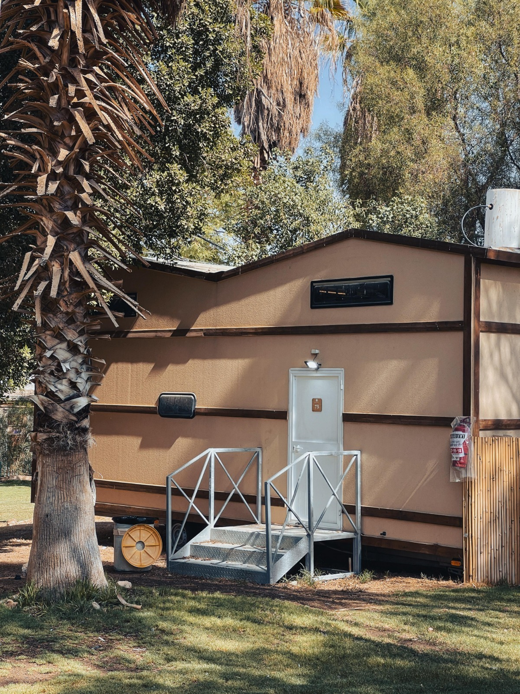

# A.G Caravans — Design System
> **Editorial Blue/White** · RTL (Hebrew) · Based on `v2/index.html` + `assets/css/styles.css`
> Use this file as the single source of truth when building new pages under `v2/`.

---

## 1. Fonts

### Google Fonts (must be loaded in `<head>`)
```html
<link rel="preconnect" href="https://fonts.googleapis.com">
<link rel="preconnect" href="https://fonts.gstatic.com" crossorigin>
<link href="https://fonts.googleapis.com/css2?family=Rubik:wght@300;400;500;600;700;800;900&family=Frank+Ruhl+Libre:wght@500;700;900&family=Heebo:wght@400;500;700;800;900&display=swap" rel="stylesheet">
```

### CSS Variables
| Variable | Stack | Usage |
|---|---|---|
| `--font` | Rubik → Heebo → system-ui | Body text, UI labels |
| `--font-ui` | Rubik → Heebo → system-ui | Buttons, inputs, prices |
| `--font-display` | Frank Ruhl Libre → Rubik → Heebo (serif) | Headings, hero H1, taglines |

---

## 2. Color Palette

### CSS Custom Properties (`:root`)

#### Blue Scale
| Variable | Value | Usage |
|---|---|---|
| `--blue-950` | `#071c38` | Darkest backgrounds |
| `--blue-900` | `#0c3058` | Primary text on light; `h2`, `h3`, `h4` |
| `--blue-800` | `#0c3058` | Nav links, secondary dark |
| `--blue-700` | `#0050cc` | Links, hover states |
| `--blue-600` | `#005ce0` | Eyebrow text, icon highlights |
| `--blue-500` | `#0068f5` | CTA underlines, price amounts, icons |
| `--blue-400` | `#3b90ff` | Border hovers |
| `--blue-200` | `#b3d4ff` | Outline borders |
| `--blue-100` | `#d4e8ff` | Card borders on hover |
| `--blue-50` | `#eef5ff` | Chip/tag backgrounds, subtle fills |
| `--accent` | `#38bdf8` | Accent icons, active highlights, contact-row icons |
| `--grad` | `linear-gradient(305deg, #0c3058, #0068f5)` | Primary gradient — buttons, header, footer, overlays |

#### Ink (Neutral) Scale
| Variable | Value | Usage |
|---|---|---|
| `--ink-900` | `#0b1220` | Deepest text |
| `--ink-800` | `#1f2937` | Default body text (`color` on `body`) |
| `--ink-700` | `#334155` | Secondary headings |
| `--ink-600` | `#4b5563` | Paragraph text inside cards |
| `--ink-500` | `#6b7280` | Muted text, descriptions |
| `--ink-400` | `#9ca3af` | Placeholders, "from" price labels |
| `--ink-300` | `#cbd5e1` | Subtle borders |
| `--ink-200` | `#e5e7eb` | Input borders, dividers |
| `--ink-100` | `#f3f4f6` | Card borders (default), drawer nav borders |
| `--ink-50` | `#f8fafc` | Section backgrounds (catalog, foodtrack), input fills |
| `--white` | `#ffffff` | Pure white |

---

## 3. Shadows

| Variable | Value | Usage |
|---|---|---|
| `--shadow-sm` | `0 1px 2px …, 0 1px 3px …` | Cards at rest |
| `--shadow-md` | `0 4px 12px …, 0 8px 24px …` | Catalog tabs, newsletter cards |
| `--shadow-lg` | `0 12px 32px …, 0 24px 60px …` | Cards on hover |
| `--shadow-xl` | `0 28px 80px rgba(12,42,91,.22)` | Contact shell |
| `--shadow-blue` | `0 14px 40px rgba(0,104,245,.28)` | `.btn-primary` hover, platform icon hover |

---

## 4. Border Radius

| Variable | Value | Usage |
|---|---|---|
| `--radius-sm` | `8px` | Small elements (checkboxes, subtle chips) |
| `--radius` | `14px` | Cards, inputs, `.contact-row`, `.auth-ico` |
| `--radius-lg` | `22px` | Section cards, media blocks, `.article-card` |
| `--radius-xl` | `30px` | Contact shell |
| `999px` | fully rounded | Buttons, pills, eyebrow tags |

---

## 5. Spacing & Layout

```css
--container: 1280px;   /* max-width for .container */
--tr: 0.35s cubic-bezier(.2,.7,.2,1);  /* default transition */
```

### `.container`
```css
max-width: var(--container);
margin: 0 auto;
padding: 0 28px;
```
Mobile (`≤640px`): `padding: 0 18px`

### Section Padding
```css
.section { padding: 120px 0; }
/* Tablet (≤900px): 80px 0 */
/* Mobile (≤640px): 64px 0 */
```

---

## 6. Typography Scale

### Headings
```css
h2 {
  font-size: clamp(30px, 4.5vw, 48px);
  font-weight: 900;
  color: #0c3058;             /* --blue-900 */
  line-height: 1.08;
  letter-spacing: -0.028em;
  margin-bottom: 18px;
}
h3, h4 { color: #0c3058; }
```

### Hero H1
```css
/* Line 1 */
font-size: clamp(40px, 7.4vw, 96px);
font-weight: 900;

/* Lines 2 & 3 */
font-size: clamp(40px, 7.4vw, 72px);
font-weight: 700;
text-shadow: 0 2px 30px rgba(0,0,0,.3);
```

### Body
```css
body {
  font-family: var(--font);
  color: var(--ink-800);
  line-height: 1.6;
}
```

---

## 7. Utility Classes

### Gradient Text
```html
<!-- on dark backgrounds (hero) -->
<span class="gradient-text-light">טקסט</span>

<!-- on light backgrounds -->
<span class="gradient-text">טקסט</span>
```
```css
.gradient-text        { background: var(--grad); -webkit-background-clip: text; -webkit-text-fill-color: transparent; }
.gradient-text-light  { background: white; -webkit-background-clip: text; -webkit-text-fill-color: transparent; display: inline-block; }
```

### Eyebrow Label
```html
<span class="eyebrow">כחול לבן</span>
<!-- Light variant (on dark overlays) -->
<span class="eyebrow light">רשויות | מועצות</span>
```
```css
.eyebrow {
  font-size: 12px; font-weight: 700; letter-spacing: 0.18em; text-transform: uppercase;
  color: var(--blue-600); background: var(--blue-50); padding: 6px 14px; border-radius: 999px;
}
.eyebrow.light { background: rgba(255,255,255,.14); color: rgba(255,255,255,.95); border: 1px solid rgba(255,255,255,.2); }
```

### Section Head (centered intro block)
```html
<div class="section-head" data-anim="fade-up">
  <span class="eyebrow">תגית</span>
  <h2>כותרת <span class="gradient-text">בולטת</span></h2>
  <p>תיאור קצר</p>
</div>
```
```css
.section-head { text-align: center; max-width: 720px; margin: 0 auto 64px; }
```

### Bullets List
```html
<ul class="bullets">
  <li><i class="fa-solid fa-check"></i> טקסט</li>
</ul>
```
```css
.bullets { display: grid; grid-template-columns: 1fr 1fr; gap: 12px; margin: 28px 0; }
.bullets li { display: flex; align-items: center; gap: 10px; font-weight: 600; color: var(--ink-800); }
.bullets li i { width: 26px; height: 26px; border-radius: 50%; background: var(--blue-50); color: var(--blue-600); font-size: 12px; }
```

---

## 8. Buttons

### Base
```html
<a class="btn btn-primary">שלח <i class="fa-solid fa-arrow-left"></i></a>
```
```css
.btn {
  display: inline-flex; align-items: center; gap: 12px;
  padding: 20px 34px; border-radius: 24px;
  font-weight: 700; font-size: 15px;
  transition: var(--tr); white-space: nowrap; line-height: 1;
}
.btn i { font-size: 13px; transition: transform var(--tr); }
.btn:hover i { transform: translateX(-3px); }
```

### Variants
| Class | Style | Use |
|---|---|---|
| `.btn-primary` | `--grad` background, white text, blue box-shadow | Main CTA |
| `.btn-outline` | Transparent, `--blue-600` text, `--blue-200` border | Secondary on light bg |
| `.btn-ghost` | Semi-transparent white bg, white border | On dark/image backgrounds |
| `.btn-white` | White bg, `--blue-900` text | On gradient/dark sections |
| `.btn-sm` | `padding: 12px 22px`, `font-size: 13.5px`, `border-radius: 20px` | Compact cards |
| `.btn-block` | `width: 100%; justify-content: center; padding-block: 20px; font-size: 16px` | Form submit |

### Button Row
```html
<div class="card-actions">
  <a href="#contact" class="btn btn-primary">צור קשר <i class="fa-solid fa-arrow-left"></i></a>
  <a href="pages/page.html" class="btn btn-outline">מידע נוסף</a>
</div>
```

---

## 9. Header

The header is **fixed**, transparent over the hero, and becomes a frosted glass bar when the user scrolls (`.header.scrolled` added via JS).

### Markup skeleton
```html
<header class="header" id="header">
  <div class="container header-inner">
    <a href="#" class="logo">
      
      
    </a>
    <nav class="nav" id="nav">
      <a href="#section">קישור</a>
    </nav>
    <div class="header-cta">
      <a href="tel:050-550-0180" class="phone-btn">
        <i class="fa-solid fa-phone"></i>
        <span><small>להתקשרות</small>050-550-0180</span>
      </a>
      <button class="hamburger" id="hamburger" aria-label="תפריט">
        <span></span><span></span><span></span>
      </button>
    </div>
  </div>
</header>
```

### States
- **Transparent (over hero):** nav links white; phone-btn uses glass-blur style.
- **`.scrolled`:** `background: rgba(255,255,255,.94)`, `backdrop-filter: blur(14px)`, bottom border + shadow. Logo swaps from `logo-white` → `logo-dark`.

---

## 10. Mobile Drawer

```html
<div class="drawer" id="drawer">
  <div class="drawer-inner">
    <button class="drawer-close" id="drawerClose" aria-label="סגירה">×</button>
    <nav class="drawer-nav">
      <a href="#section">קישור</a>
    </nav>
    <a href="tel:050-550-0180" class="drawer-phone">
      <i class="fa-solid fa-phone"></i> 050-550-0180
    </a>
  </div>
</div>
```
Opens by adding `.open` to `.drawer`. Breakpoint: `≤1100px` — hamburger visible, nav hidden.

---

## 11. Components

### Model Card
```html
<article class="model-card" data-anim="fade-up">
  <span class="model-num">01</span>
  <div class="model-img"></div>
  <div class="model-body">
    <span class="model-meta">תגית</span>
    <h3>שם הדגם</h3>
    <p>תיאור</p>
    <div class="model-price">
      <span class="price-from">החל מ–</span>
      <span class="price-amount">₪320,000</span>
    </div>
    <div class="w-actions">
      <a href="#contact" class="w-btn w-btn-contact">יצירת קשר</a>
      <a href="pages/…"  class="w-btn w-btn-info">מידע נוסף</a>
    </div>
  </div>
</article>
```
Grid: `repeat(4, 1fr)` → `repeat(2, 1fr)` at `≤1200px`.

### Security Panel
```html
<div class="security-panel" data-anim="fade-right">
  <div class="security-panel-img">
    
    <div class="security-panel-overlay"></div>
  </div>
  <div class="security-panel-body">
    <span class="security-panel-num">01</span>
    <h3>כותרת</h3>
    <p>תיאור</p>
    <ul class="security-features">
      <li><i class="fa-solid fa-shield-halved"></i> תכונה</li>
    </ul>
    <div class="card-actions">
      <a href="#contact" class="btn btn-primary btn-sm">צור קשר <i class="fa-solid fa-arrow-left"></i></a>
      <a href="pages/…"  class="btn btn-ghost btn-sm">מידע נוסף</a>
    </div>
  </div>
</div>
```

### Authorities Card (with bg image)
```html
<section class="section authorities" id="authorities">
  <div class="auth-bg">
    
    <div class="auth-bg-overlay"></div>
  </div>
  <div class="container">
    <div class="auth-card">
      <div class="auth-text">
        <span class="eyebrow light">תגית</span>
        <h2>כותרת</h2>
        <p>תיאור</p>
        <div class="card-actions">
          <a href="#contact" class="btn btn-white">צור קשר <i class="fa-solid fa-arrow-left"></i></a>
          <a href="pages/…"  class="btn btn-ghost">מידע נוסף</a>
        </div>
      </div>
      <div class="auth-icons">
        <div class="auth-ico"><i class="fa-solid fa-utensils"></i><span>שם שירות</span></div>
      </div>
    </div>
  </div>
</section>
```

### Article Card
```html
<article class="article-card">
  <div class="article-img"></div>
  <div class="article-body">
    <span class="article-cat">קטגוריה</span>
    <h3>כותרת</h3>
    <a href="#" class="article-link">למידע נוסף <i class="fa-solid fa-arrow-left"></i></a>
  </div>
</article>
```

### Newsletter Card
```html
<article class="nl-card">
  <div class="nl-header">
    <i class="fa-regular fa-newspaper"></i>
    <span class="nl-issue">גיליון 01 · קיץ 2024</span>
  </div>
  <div class="nl-body">
    <h3>כותרת</h3>
    <p>תיאור</p>
    <a href="#" class="article-link">לקריאה <i class="fa-solid fa-arrow-left"></i></a>
  </div>
</article>
```

### Press Card
```html
<article class="press-card">
  <div class="press-source">
    <span class="press-name">שם מקור</span>
    <span class="press-date">ינואר 2025</span>
  </div>
  <h3>כותרת הכתבה</h3>
  <a href="#" class="press-link">לכתבה המלאה <i class="fa-solid fa-arrow-up-right-from-square"></i></a>
</article>
```

### Tabs (Catalog / Articles)
```html
<div class="tabs-head">
  <button class="tab-btn active" data-tab="local">כרטיסייה 1</button>
  <button class="tab-btn"        data-tab="import">כרטיסייה 2</button>
</div>
<div class="tab-pane active" data-pane="local">תוכן 1</div>
<div class="tab-pane"        data-pane="import">תוכן 2</div>
```
For the articles section use `.art-tabs` / `.art-tab-btn` / `.art-pane` with `data-art-tab` / `data-art-pane`.

### Contact Form
Two-column shell (`.contact-shell`): left = feature image card, right = form.
```html
<div class="contact-shell">
  <div class="contact-feature">…</div>
  <form class="contact-form">
    <div class="form-head"><h3>…</h3><p>…</p></div>
    <div class="form-row"><label><span>שם</span><input type="text" required></label></div>
    <div class="form-row split">
      <label><span>אימייל</span><input type="email" required></label>
      <label><span>טלפון</span><input type="tel" required></label>
    </div>
    <label class="consent"><input type="checkbox"><span>…</span></label>
    <button type="submit" class="btn btn-primary btn-block">שליחה <i class="fa-solid fa-paper-plane"></i></button>
  </form>
</div>
```

---

## 12. Weinsberg / Catalog Grid
```html
<div class="weinsberg-grid">
  <div class="w-card">
    
    <span>שם הדגם</span>
    <span class="w-price">₪195,000</span>
    <div class="w-actions">
      <a href="#contact" class="w-btn w-btn-contact">יצירת קשר</a>
      <a href="pages/…"  class="w-btn w-btn-info">מידע נוסף</a>
    </div>
  </div>
</div>
```
Grid: `repeat(3, 1fr)`.

---

## 13. Footer

```html
<footer class="footer">
  <div class="container">
    <div class="footer-grid">
      <div class="footer-col">
        <a href="#" class="footer-logo"></a>
        <p>תיאור חברה</p>
      </div>
      <div class="footer-col">
        <h4>ניווט</h4>
        <ul><li><a href="#">קישור</a></li></ul>
      </div>
      <div class="footer-col">
        <h4>שעות פתיחה</h4>
        <ul class="hours">
          <li><span>א – ה</span><span>08:00 – 16:00</span></li>
        </ul>
      </div>
      <div class="footer-col">
        <h4>צור קשר</h4>
        <ul class="contact-list">
          <li><a href="tel:…"><i class="fa-solid fa-phone"></i> מספר</a></li>
        </ul>
      </div>
    </div>
    <div class="footer-bottom">
      <div class="footer-links"><a href="#">פרטיות</a></div>
      <p>© כל הזכויות שמורות</p>
    </div>
  </div>
</footer>
```
Background: `var(--grad)`.  
Grid: `1.2fr 1fr 1fr 1.2fr` → `1fr 1fr` at `≤900px` → `1fr` at `≤640px`.

---

## 14. Scroll Animations

Animate elements by adding `data-anim` to any element. JS in `assets/js/script.js` handles the GSAP ScrollTrigger animations.

| Value | Effect |
|---|---|
| `data-anim="fade-up"` | Fades in + slides up |
| `data-anim="fade-right"` | Fades in + slides from right |
| `data-anim="fade-left"` | Fades in + slides from left |
| `data-anim="zoom-in"` | Fades in + scales up slightly |

Optional: `data-delay="0.1"` (seconds) for staggered children.

---

## 15. Floating WhatsApp Button
```html
<a href="https://wa.me/972505500180" class="float-wa" aria-label="WhatsApp">
  <i class="fa-brands fa-whatsapp"></i>
</a>
```
Always include at the very end of `<body>`, just before the scripts.

---

## 16. External Scripts (must be in every page)
```html
<!-- Font Awesome (icons) -->
<link rel="stylesheet" href="https://cdnjs.cloudflare.com/ajax/libs/font-awesome/6.5.1/css/all.min.css">

<!-- GSAP + ScrollTrigger (animations) -->
<script src="https://cdnjs.cloudflare.com/ajax/libs/gsap/3.12.5/gsap.min.js"></script>
<script src="https://cdnjs.cloudflare.com/ajax/libs/gsap/3.12.5/ScrollTrigger.min.js"></script>

<!-- Site JS -->
<script src="assets/js/script.js"></script>
```
> Adjust the relative path to `assets/js/script.js` based on the page's depth (e.g. `../assets/js/script.js` for pages inside `pages/`).

---

## 17. Page `<head>` Template
```html
<!DOCTYPE html>
<html lang="he" dir="rtl">
<head>
  <meta charset="UTF-8">
  <meta name="viewport" content="width=device-width, initial-scale=1.0">
  <title>כותרת עמוד – א.ג קראוונים</title>
  <meta name="description" content="תיאור עמוד עד 160 תווים.">

  <!-- Fonts -->
  <link rel="preconnect" href="https://fonts.googleapis.com">
  <link rel="preconnect" href="https://fonts.gstatic.com" crossorigin>
  <link href="https://fonts.googleapis.com/css2?family=Rubik:wght@300;400;500;600;700;800;900&family=Frank+Ruhl+Libre:wght@500;700;900&family=Heebo:wght@400;500;700;800;900&display=swap" rel="stylesheet">

  <!-- Icons -->
  <link rel="stylesheet" href="https://cdnjs.cloudflare.com/ajax/libs/font-awesome/6.5.1/css/all.min.css">

  <!-- Site CSS (adjust path for sub-pages) -->
  <link rel="stylesheet" href="assets/css/styles.css">

  <!-- Favicon -->
  <link rel="icon" type="image/png" href="assets/img/logo.png">
</head>
```

---

## 18. Responsive Breakpoints Summary

| Breakpoint | Columns change |
|---|---|
| `≤1200px` | Models grid: 4 → 2 col |
| `≤1100px` | Desktop nav hidden, hamburger shown; phone-btn text hidden |
| `≤900px` | Most 2-col grids → 1 col; section padding 120px → 80px; hero becomes full-height |
| `≤640px` | Single-column everywhere; tighter padding; hero text smaller; bullets single col |
